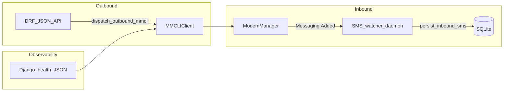

## Architecture

hiWaveTel is a **Django 5.x** deployment that bridges **ModemManager** (`mmcli` + **D-Bus**) to REST clients for inbound/outbound SMS. The design favours clarity over layering indirection suitable for firmware-style edge hosts.

### High-level flows

### Applications

| Path | Responsibility |
|------|----------------|
| `[apps/sms/](apps/sms/)` | Models (`InboundSms`, `OutboundSms`), DRF routers, serializers, **`MMCLIClient`**, **`services.dispatch_outbound_mmcli`**, D-Bus watcher, management command **`run_sms_watcher`**, OpenAPI-heavy viewsets |
| Legacy **`apps/core`** removed | Modem health lived here previously; **`health_modem_manager`** now ships as `[apps/sms/views_health.py](apps/sms/views_health.py)` to avoid **`core` ⇢ `sms`** import inversion |

### Settings layout

Environment selection:

- **`DJANGO_ENV=development`** (default for local Compose) → forgiving `SECRET_KEY` fallback, permissive localhost `ALLOWED_HOSTS`.
- **`DJANGO_ENV=production`** → **requires** `DJANGO_SECRET_KEY`, explicit **`DJANGO_ALLOWED_HOSTS`** (no `*`).

Modules: `[config/settings/base.py](config/settings/base.py)` + `[development.py](config/settings/development.py)` / `[production.py](config/settings/production.py)`.

### Authentication & observability

- SMS list/create and OpenAPI schema/docs use **`rest_framework.permissions.IsAuthenticated`** plus **JWT** (SimpleJWT obtain/refresh under `/api/auth/`).
- **`GET /api/health/`** remains **anonymous** (`JsonResponse`) for container / load balancer probes — it exposes only synthetic modem metadata, never SIM secrets.

### Data store

SQLite by default with optional `SQLITE_DB_PATH` (mounted volume in Compose). Indexes on outbound support listing by **state**/time and **modem**/time; inbound keeps a **`(-created_at, from_number)`** composite plus field indexes suited to filtering.
