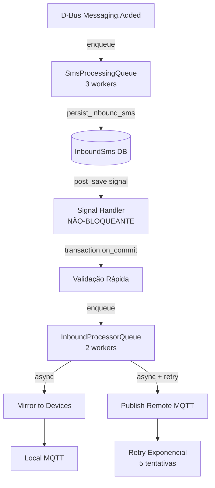

# Interface de comunicação hiWaveTel

Este documento descreve todos os mecanismos públicos de integração: **HTTP (REST)** e **MQTT**. Serve como guia para outro serviço ou equipamento reportar SMS recebidos, pedir envios e acompanhar estado.

Referência normativa complementar: **OpenAPI** em `GET /api/schema/` e interface **Swagger** em `GET /api/docs/` (quando o servidor Django está a correr).

Especificação autocontida para um **gateway cliente MQTT** frente a servidor tipo hiDisheLink (tópicos, JSON, mosquitto, checklist): ficheiro `docs/gateway-mqtt-hidishelink-especificacao.md`.

---

## 1. Visão geral

Existem **dois eixos** independentes:

| Eixo | Base URL | Autenticação típica | Finalidade |
|------|----------|---------------------|------------|
| **Gateway dispositivos externos** | `https://{HOST}/api/v1/` | Chave API (`X-API-Key` ou `Authorization: ApiKey …`) | Integração de **dispositivos/aplicações externas** com o modem gerido pelo hiWaveTel (envio agregado, inbox por dispositivo). |
| **API SMS operador** | `https://{HOST}/api/sms/…` | JWT Bearer (utilizador Django) | Operação directa sobre SMS persistidos em base de dados e envio via **mmcli** no servidor. |

Em paralelo, um processo opcional **`run_mqtt_gateway`** (arrancado no contentor quando `RUN_MQTT_GATEWAY=true`) mantém um cliente MQTT persistente: subscreve tópicos de dispositivos, publica pedidos de envio e telemetria do modem, conforme descrito na secção MQTT. Quando `MQTT_HEALTH_SERVER_PING_INTERVAL_SEC` é maior que zero, esse mesmo cliente publica periodicamente pings **tipo B** (`source: django`) para cada `ExternalDevice` em estado activo — comportamento que **não** ocorre apenas com o servidor HTTP Gunicorn sem este processo.

---

## 2. Autenticação HTTP

### 2.1 API v1 — dispositivo externo

Implementação: `apps/external_device/authentication.py`.

- **`X-API-Key: <chave_em_claro>`** — recomendado para integrações simples.
- **`Authorization: ApiKey <chave_em_claro>`** — alternativa compatível.

A chave só é mostrada **uma vez** no registo (ver `POST …/register/`). O servidor guarda hash SHA-256.

### 2.2 API SMS — JWT

1. Obter tokens: `POST /api/auth/token/` com corpo JSON `{"username":"…","password":"…"}` (utilizador Django válido).
2. Chamadas subsequentes: cabeçalho **`Authorization: Bearer <access>`**.

Renovação: `POST /api/auth/token/refresh/` com `{"refresh":"…"}`.

### 2.3 Endpoints sem autenticação obrigatória

- `POST /api/v1/external-devices/register/` — público; exige `registration_token` válido criado no admin.
- `POST /api/sms/device/register/` — público (contrato app Android hiDisheLink); mesmo modelo `ExternalDevice`, envelope `{ success, data, error }`.
- `GET /api/health/` — sonda de disponibilidade modem/mmcli (sem segredos).

---

## 3. Referência REST — Gateway `/api/v1/`

Prefixo: `{BASE}/api/v1/` onde `{BASE}` é por exemplo `http://127.0.0.1:8000` ou o URL público do gateway.

Rotas definidas em `apps/external_device/urls.py`. Modelos de pedido/resposta: `apps/external_device/serializers.py`.

### Superfície paralela — App hiDisheLink (`/api/sms/device/`)

Contrato compatível com a **app Android hiDisheLink SMS**: **`{BASE}/api/sms/device/`** (`register`, `login`, `refresh`, `logout`, `status`, `mqtt-config`, `get-pending-key`), envelope **`success`** / **`data`** / **`error`**, sessões em base (`DeviceSession`). `GET status` e `GET mqtt-config` usam **`X-API-Key`** e **`device_id`**. O corpo `data` de `GET mqtt-config` é obtido por proxy do servidor hiDisheLink (`HIDISHELINK_API_URL` ou credenciais em `HiDishelinkDevice`), espelhando o JSON remoto (`MQTT_*`, `TOPIC_*` com **`{device_id}`**, etc.). Ficheiros: `apps/external_device/device_urls.py`, `device_api_views.py`, `mqtt_config_remote.py`.

### 3.1 Registo de dispositivo

**`POST /api/v1/external-devices/register/`**

Corpo JSON esperado:

| Campo | Obrigatório | Descrição |
|-------|-------------|-----------|
| `device_id` | sim | Identificador estável do dispositivo (ex.: MSISDN ou UUID interno), até 64 caracteres. |
| `registration_token` | sim | Token único gerado no Django Admin para este dispositivo pendente. |
| `name` | sim | Nome legível. |
| `device_type` | não | Default `modem`. |
| `mqtt_client_id` | não | Opcional; pode ser usado em integrações MQTT. |
| `metadata` | não | Objeto JSON livre (ex.: `{ "modem_index": 0 }` para filtrar inbox espelhada por modem). |

Resposta `200` inclui `api_key`, `device_id`, `status`. **Guarde a `api_key`** — não volta a ser exibida.

### 3.2 Enviar SMS (agregado)

**`POST /api/v1/sms/send/`** — requer API key.

Corpo:

```json
{
  "recipients": ["+351912345678"],
  "message": "Texto UTF-8 do SMS",
  "priority": "normal"
}
```

`priority`: `normal` \| `high` \| `urgent`.

Resposta típica **`202 Accepted`**:

```json
{
  "request_id": "sms_<token>",
  "status": "processing"
}
```

O servidor cria `SmsRequest`, envia via mmcli para cada destinatário e atualiza estado. Se `MQTT_PUBLISH_SEND_REQUEST` estiver activo, também publica no MQTT (ver secção 6).

### 3.3 Estado do pedido de envio

**`GET /api/v1/sms/status/?request_id=<valor>`** — requer API key.

Devolve `request_id`, `status`, `sent_count`, `failed_count`, lista `recipients` com `phone_number`, `status`, `message_id`, `error_message`.

### 3.4 Inbox do dispositivo

**`GET /api/v1/sms/inbox/`** — requer API key.

- Resposta **paginada** (pagination DRF, típico `page` na query string; `page_size` definido em settings REST).
- Campos de cada mensagem: **`message_id`**, **`sender`**, **`body`**, **`received_at`** (ISO 8601).

Comportamento importante: antes de listar, o servidor chama **`sync_inbox_from_modem_store`**, que espelha linhas `InboundSms` (modem interno / mmcli) para `InboxMessage` deste dispositivo. Assim, SMS recebidos pelo watcher D-Bus do hiWaveTel aparecem na inbox API mesmo sem MQTT.

- Se `device.metadata["modem_index"]` for um inteiro, só entram SMS desse índice de modem; caso contrário entram todas as `InboundSms` visíveis (últimas 500 na sincronização).

### 3.5 Saúde do dispositivo

**`GET /api/v1/external-devices/{device_id}/health/`** — requer API key.

Devolve campos do modelo `ExternalDevice` relevantes para presença: `device_id`, `status`, `is_available`, `last_seen`.

### 3.6 Exemplos `curl` (placeholders)

Substitua `HOST`, `PORT`, `API_KEY`, `REQUEST_ID`.

```bash
# Registo (sem API key)
curl -s -X POST "http://HOST:PORT/api/v1/external-devices/register/" \
  -H "Content-Type: application/json" \
  -d '{"device_id":"meu-modem-1","registration_token":"TOKEN_DO_ADMIN","name":"Gateway Loja"}'

# Enviar SMS
curl -s -X POST "http://HOST:PORT/api/v1/sms/send/" \
  -H "Content-Type: application/json" \
  -H "X-API-Key: API_KEY" \
  -d '{"recipients":["+351912345678"],"message":"Olá","priority":"normal"}'

# Estado
curl -s "http://HOST:PORT/api/v1/sms/status/?request_id=REQUEST_ID" \
  -H "X-API-Key: API_KEY"

# Inbox
curl -s "http://HOST:PORT/api/v1/sms/inbox/" \
  -H "X-API-Key: API_KEY"

# Health do dispositivo
curl -s "http://HOST:PORT/api/v1/external-devices/meu-modem-1/health/" \
  -H "X-API-Key: API_KEY"
```

---

## 4. Referência REST — API SMS (JWT) `/api/`

Prefixo: `{BASE}/api/sms/…` (sem o `v1`). Requer **`Authorization: Bearer <access>`** em todas as operações listadas.

### 4.1 SMS recebidos (modem → base de dados)

- **`GET /api/sms/inbound/`** — lista `InboundSms` (read-only).
- **`GET /api/sms/inbound/{id}/`** — detalhe.

Query opcional:

- `from` — filtro parcial ao número de origem.
- `since` — ISO 8601; apenas mensagens com `created_at >= since`.

Campos principais do modelo: `mm_path`, `modem_index`, `from_number`, `text`, `mm_state`, `created_at`, etc.

### 4.2 SMS enviados (servidor → mmcli)

- **`POST /api/sms/outbound/`** — cria e envia.

Corpo JSON:

```json
{
  "modem_index": 0,
  "to": "+351912345678",
  "text": "Corpo UTF-8; o limite efectivo é o da rede GSM/PDU, não este campo."
}
```

`modem_index` é opcional; default do ambiente (`MODEM_MMCLI_INDEX`).

Resposta **`202`** com estado (`sent`, `failed`, …) e eventual `error_message`.

### 4.3 Exemplo `curl` com JWT

```bash
TOKEN="$(curl -s -X POST "http://HOST:PORT/api/auth/token/" \
  -H "Content-Type: application/json" \
  -d '{"username":"USER","password":"PASS"}' \
  | python3 -c 'import sys,json; print(json.load(sys.stdin)["access"])')"

curl -s "http://HOST:PORT/api/sms/inbound/" \
  -H "Authorization: Bearer ${TOKEN}"
```

---

## 5. Health do sistema (modem)

**`GET /api/health/`** — sem autenticação.

Resposta JSON (campos principais):

- `ok` — boolean, `true` se o modem configurado responde ao ping mmcli.
- `modem_mmcli_indices` — índices listados por `mmcli -L`.
- `settings_modem_mmcli_index` — índice esperado pela configuração.
- `modem_mmcli_ping_ok` — resultado do ping ao índice configurado.
- `mmcli_notes` — texto curto de diagnóstico em caso de falha.

Código HTTP **503** quando não há modems ou ping falha; **200** quando `ok` é verdadeiro.

### 5.6 Estado de presença no admin e mensagens com `source: "django"` (MQTT health)

O Django Admin (**`/admin/external_device/externaldevice/`**) reflecte presença através dos campos **`is_available`** e **`last_seen`** do modelo **`ExternalDevice`**. Estes campos são actualizados quando o backend recebe:

- um **`health/ping`** tratado como **telemetria** em `GatewayMqttClient._handle_health_ping` (payload **sem** `"source"` exactamente igual a **`django`** e com **`battery_level`** e/ou **`network_type`**) — persistência via `DeviceHealthTelemetry` + `ExternalDevice.mark_seen()` ([`apps/external_device/mqtt_client.py`](../apps/external_device/mqtt_client.py)), **ou**
- um **`health/pong`** publicado pela app ou gateway cliente em **`…/health/pong`** — o gateway chama `ExternalDevice.mark_seen()` em `_handle_health_pong` assim que resolve o `{id}` sanitizado (**repor o mesmo `ping_id` que veio no ping do servidor** é a prática esperada para seguir pedido/resposta lado a lado e nos logs).

O hiWaveTel (e integrações tipo hiDisheLink) publicam pedidos activos em `…/health/ping` com um payload neste formato:

```json
{
  "ping_id": "ping_9895bccfaed4",
  "timestamp": "2026-05-17T19:01:59.723880+00:00",
  "source": "django"
}
```

Esse tráfego pode aparecer nos logs MQTT do broker ou do gateway **antes** de outras callbacks de health. **Por desenho**, mensagens `health/ping` com `"source": "django"` são **ignoradas** para actualizar disponibilidade: caso contrário o eco seria contado como “batimento do telemóvel” e falsificaria o estado.

Com **`LOG_LEVEL=DEBUG`**, o gateway (`GatewayMqttClient`) regista uma linha explícita quando ignora esse eco do ping do Django e resume o que o integrador deve fazer.

**Cliente esperado:** a app Android **hiDisheLink SMS** desse equipamento (**`device_id`**) **ou** um **gateway/API externo** que se ligue ao **broker** e use os **`TOPIC_*`** devolvidos por **`GET /api/sms/device/mqtt-config/`**. Este papel é **distinto** do processo servidor Django (**não** é o servidor “consumir” o próprio ping) e **não** cobre uma integração **apenas REST** sem cliente MQTT quando se pretende cumprir o ciclo **health**/presença descrito aqui.

**Conclusão para integradores:** ver linhas de log com `source: django` **não** significa que o dispositivo respondeu; significa que o servidor (ou o eco da própria publicação) foi recebido. Para **actualizar presença no admin**, o cliente **tem de**:

1. **Subscrever** `TOPIC_HEALTH_PING` (tópico resolvido na resposta `mqtt-config`, com `{device_id}` sanitizado).
2. Ao receber JSON com `"source": "django"` e `ping_id`, **publicar** em `TOPIC_HEALTH_PONG` o **mesmo** `ping_id` (+ `timestamp` / `app_version` opcionais).
3. **E/ou** publicar **`health/ping`** com telemetria que o servidor persista (**`battery_level`** e/ou **`network_type`**) e **sem** `"source"` igual a **`django`** (alternativa a só responder com pong — ver código e § 6.7).

Com **`MQTT_HEALTH_AUTO_PONG=true`** (valor por defeito), o próprio cliente MQTT **`run_mqtt_gateway`** publica também **`health/pong`** quando recebe `health/ping` com **`ping_id`**, **incluindo** payloads **`source: django`** — em linha com o comentário em **`.env.example`**. **`MQTT_HEALTH_GATEWAY_AUTO_PONG_DJANGO`** mantém‑se só como segundo interruptor opcional combinado nas settings (cenários raros); em instalações normais basta **`MQTT_HEALTH_AUTO_PONG`**.

---

## 6. MQTT — configuração

Todas as variáveis listadas em `.env.example` sob a secção MQTT; as mais relevantes:

| Variável | Função |
|----------|--------|
| `MQTT_EXTERNAL_TOPIC_PREFIX` | Prefixo base para **catálogo/modems** (`…/modems/…`) quando `MQTT_BASE_TOPIC_PREFIX` não está definido (default de código: `hidishelink_dev`). |
| `MQTT_BASE_TOPIC_PREFIX` | Prefixo explícito para modems/snapshot (hiDisheLink). Por defeito igual a `MQTT_EXTERNAL_TOPIC_PREFIX`. |
| `MQTT_DEVICE_TOPIC_PREFIX` | Prefixo completo **antes** de `/{id}/sms/…` e `/{id}/health/…` (hiDisheLink). Por defeito `{MQTT_BASE_TOPIC_PREFIX}/devices`. Valores como `${MQTT_BASE_TOPIC_PREFIX}/devices` são expandidos em `config/settings/base.py` (o Django não expande variáveis de shell genericamente). |
| `MQTT_BROKER_URL`, `MQTT_PORT` | Broker e porta. Se a porta for **8883**, o cliente activa TLS. |
| `MQTT_USER`, `MQTT_PASS` | Credenciais opcionais. |
| `MQTT_CLIENT_ID` | ID do cliente do **gateway** em modo loop persistente. |
| `MQTT_QOS`, `MQTT_CLEAN_SESSION` | Comportamento de sessão Paho. |
| `MQTT_PUBLISH_SEND_REQUEST` | Se verdadeiro, após `POST …/sms/send/` o gateway também publica o pedido em `{device_prefix}/{id}/sms/send` (publicação **efémera** por pedido HTTP). |
| `MQTT_PUBLISH_MODEM_INBOX` | Se verdadeiro, ao espelhar SMS do modem para dispositivos, o gateway pode publicar em `inbox_delivery`. |
| `MQTT_MODEM_INBOX_DELIVERY_MODE` | `broadcast` (um tópico por modem) ou `per_device` (um tópico por `device_id`). |

**Sanitização de `device_id` nos tópicos:** caracteres `+` e `#` são removidos do identificador quando inserido no path MQTT (evitar conflito com wildcards MQTT).

### 6.6 Exemplo JSON de **resposta**: `TOPIC_HEALTH_PONG` (`{device_prefix}/{id}/health/pong`)

Resposta típica (recomenda-se sempre incluir **`ping_id`** igual ao enviado no ping do servidor, para correlacionar logs no broker):

```json
{
  "ping_id": "ping_b6d5d5d5d500",
  "timestamp": "2026-05-17T20:41:52.068Z",
  "app_version": "1.2.34"
}
```

O gateway (`GatewayMqttClient._handle_health_pong`) chama **`ExternalDevice.mark_seen()`** assim que reconhece o `device_id` no tópico; **`ping_id`** aparece sobretudo nos logs e na integração com o lado cliente — deve ser **mantido igual** ao do ping para poder seguir fluxo lado a lado.

### 6.7 Checklist mínimo (integração cliente / gateway — health MQTT)

| # | Passo |
|---:|--------|
| 1 | Resolver broker e placeholders via **`GET …/mqtt-config`** (credenciais, `MQTT_*`, `TOPIC_HEALTH_PING`, `TOPIC_HEALTH_PONG`, QoS quando expostos). |
| 2 | Aplicar **sanitização** do `device_id` nos paths (remover **`+`** e **`#`**, ver função `sanitize_device_id`). |
| 3 | **Subscrever** `TOPIC_HEALTH_PING`. |
| 4 | Ao receber **`health/ping`** com `"source":"django"` e **`ping_id`**, **publicar** em **`TOPIC_HEALTH_PONG`** o **mesmo** **`ping_id`** (`timestamp` / `app_version` opcionais). |
| 5 | Alternativa ao pong: publicar **`health/ping`** **sem** `source` igual a **`django`** e com **`battery_level`** e/ou **`network_type`** (campos que activam **`_persist_health_ping_telemetry`** + **`mark_seen()`**); outros JSON em `health/ping` **não** actualizam `last_seen`, embora possam disparar pong automático do gateway se (**`ping_id`** + **`MQTT_HEALTH_AUTO_PONG`**) aplicável ao legado (ver código). |
| 6 | Manter QoS e reconexão alinhadas com o configurado pelo backend; usar **`LOG_LEVEL=DEBUG`** no gateway para mensagens específicas sobre pings `source=django`. |

*(Este quadro não substitui fluxos SMS ou quotas; apenas consolida presença e health MQTT.)*

---

## 7. MQTT — tópicos e payloads

Nos exemplos abaixo, `{device_prefix}` = `MQTT_DEVICE_TOPIC_PREFIX` efectivo (por defeito `{MQTT_BASE_TOPIC_PREFIX}/devices`, tipicamente `{MQTT_EXTERNAL_TOPIC_PREFIX}/devices`), `{modem_prefix}` = `MQTT_BASE_TOPIC_PREFIX` efectivo, `{id}` = `device_id` sanitizado, `{N}` = índice numérico do modem (mmcli).

Payloads são **JSON UTF-8** salvo indicação em contrário.

| Tópico (padrão) | Publica | Subscreve | Payload / notas |
|-----------------|---------|-----------|------------------|
| `{device_prefix}/{id}/sms/send` | Gateway | Dispositivo externo (opcional) | Quando activo: `request_id`, `recipients`, `message`, `priority` (igual ao processamento HTTP). |
| `{device_prefix}/+/sms/status` | Dispositivo | Gateway | Atualização de estado do pedido. Ver tabela abaixo. |
| `{device_prefix}/+/sms/inbox` | Dispositivo | Gateway | SMS recebido reportado pelo dispositivo. Ver tabela abaixo. |
| `{device_prefix}/{id}/sms/inbox/ack` | Gateway | Dispositivo | `{"message_id":"…"}` após persistir inbox. |
| `{device_prefix}/{id}/sms/inbox_delivery` | Gateway | Qualquer cliente | Espelho modem→dispositivo, modo **`per_device`**. Campos: `message_id`, `sender`, `body`, `received_at`. |
| `{modem_prefix}/modems/{N}/sms/inbox_delivery` | Gateway | Qualquer cliente | Modo **`broadcast`**: inclui também `modem_index`, `mirrored_device_ids`, `device_message_ids` e `message_id` agregado. |
| `{modem_prefix}/modems/+/status/request` | Cliente | Gateway | Corpo ignorado para lógica; dispara snapshot mmcli. |
| `{modem_prefix}/modems/{N}/status/response` | Gateway | Cliente | Resposta única com `modem_index`, `gathered_at`, `mmcli_flat`, `success`, `error`. |
| `{device_prefix}/{id}/health/ping` | Gateway (tipo servidor com **`MQTT_HEALTH_SERVER_PING_INTERVAL_SEC` > 0**) e cliente | Gateway (+ outros subscritores) | **`source:"django"`** + **`ping_id`**: pedido de latência ao dispositivo; **só receber este ping não actualiza presença** (§ **5.6**). Com **`MQTT_HEALTH_AUTO_PONG=true`**, o **gateway também publica** `health/pong` com **`ping_id` ecoado** (tipo B igual ao comportamento legacy com **`ping_id`**). **Telemetria** (**`battery_level`** / **`network_type`**, **`source`** ≠ `django` exactamente) → **`mark_seen()`** via persistência em ping. Opcional **`MQTT_HEALTH_GATEWAY_AUTO_PONG_DJANGO`**: combinado nas settings com **`MQTT_HEALTH_AUTO_PONG`** (ver código). |
| `{device_prefix}/{id}/health/pong` | Dispositivo, ou **gateway** com **`MQTT_HEALTH_AUTO_PONG=true`** ao receber um ping com **`ping_id`** (incl. **`source: django`**) | Gateway | **`ping_id`** igual ao **`health/ping`** **recomendado** para correlacionar logs; **`ExternalDevice.mark_seen()`** quando o servidor recebe o pong (`GatewayMqttClient._handle_health_pong`). Opcionais **`timestamp`**, **`app_version`**. |

O gateway actualiza `SmsRequest` via `update_request_from_mqtt_status`:

| Campo | Tipo | Descrição |
|-------|------|-----------|
| `request_id` | string | **Obrigatório.** Deve coincidir com o devolvido pelo `POST …/sms/send/`. |
| `status` | string | `received` → processing; `success` → completed; `partial` → partial; `error` → failed; outros → processing. |
| `sent` | número | Contagem enviados com sucesso. |
| `failed` | número | Contagem falhas. |
| `details` | lista | Cada elemento: `recipient`, `status` (`sent` ou outro), `message_id`, `error_message`. |

### 7.2 Payload `…/sms/inbox` (dispositivo → gateway)

`persist_inbox_from_mqtt` exige:

| Campo | Obrigatório | Descrição |
|-------|-------------|-----------|
| `message_id` | sim | ID único da mensagem no sistema do dispositivo. |
| `sender` | sim | Número ou identificador do remetente. |
| `body` | não | Texto; pode ser string vazia. |
| `timestamp` | não | ISO 8601; se inválido ou ausente, usa relógio do servidor. |

---

## 8. Fluxos para integração de “outro projeto”

### 8.1 Apenas HTTP

1. Admin cria dispositivo pendente + `registration_token`.
2. Cliente chama `POST …/register/` e guarda `api_key`.
3. `POST …/sms/send/` com lista de destinatários.
4. Polling `GET …/sms/status/` até estado terminal.
5. `GET …/sms/inbox/` para SMS recebidos (incluindo os espelhados do modem interno).

### 8.2 HTTP + MQTT

Mesmo fluxo HTTP; em paralelo:

- **Subscrever** `{prefix}/modems/{N}/sms/inbox_delivery` (broadcast) ou `{prefix}/devices/{id}/sms/inbox_delivery` (per_device) para receber cópias push de SMS recebidos pelo modem do hiWaveTel.
- **Subscrever** `{prefix}/devices/{id}/sms/send` se quiser replicação dos pedidos de envio quando `MQTT_PUBLISH_SEND_REQUEST` está activo.
- **Publicar** em `{prefix}/devices/{id}/sms/status` para actualizar estado sem HTTP.
- **Subscrever** `{prefix}/modems/{N}/status/telemetry` para telemetria mmcli.

### 8.3 Dispositivo que recebe SMS localmente (sem usar inbox do servidor)

Publicar para **o mesmo `{prefix}` e `device_id` registado**:

- Tópico: `{prefix}/devices/<id_sanitizado>/sms/inbox`
- Payload JSON válido com `message_id`, `sender` e opcionalmente `body`, `timestamp`.

O gateway persiste na inbox API e pode publicar **ACK** em `{prefix}/devices/{id}/sms/inbox/ack`.

### 8.4 Exemplo mínimo com `mosquitto`

```bash
# Subscrever telemetria do modem 0 (substituir PREFIX e HOST do broker)
mosquitto_sub -h MQTT_HOST -p 1883 \
  -t 'PREFIX/modems/0/status/telemetry' -v

# Pedir snapshot puntual ao gateway (broker precisa aceitar publishes do cliente)
mosquitto_pub -h MQTT_HOST -p 1883 \
  -t 'PREFIX/modems/0/status/request' -m '{}'
```

### 8.5 Esboço Python (`paho-mqtt`)

```python
import json
import paho.mqtt.client as mqtt

PREFIX = "hidishelink_dev"
DEVICE_ID = "meu-modem-1".replace("+", "").replace("#", "")

def on_connect(client, userdata, flags, rc):
    client.subscribe(f"{PREFIX}/devices/{DEVICE_ID}/sms/send", qos=1)
    client.subscribe(f"{PREFIX}/devices/{DEVICE_ID}/sms/inbox/ack", qos=1)

def on_message(client, userdata, msg):
    data = json.loads(msg.payload.decode("utf-8"))
    if msg.topic.endswith("/sms/send"):
        # Reagir a request_id, recipients, message, priority
        print("send job", data)
    elif msg.topic.endswith("/inbox/ack"):
        print("acked", data.get("message_id"))

client = mqtt.Client(client_id="ext_proj_01", protocol=mqtt.MQTTv311)
client.on_connect = on_connect
client.on_message = on_message
client.connect("MQTT_HOST", 1883, 60)
client.loop_forever()
```

Para **reportar** um SMS recebido:

```python
topic = f"{PREFIX}/devices/{DEVICE_ID}/sms/inbox"
payload = {
    "message_id": "ext-001",
    "sender": "+351912345678",
    "body": "Olá",
    "timestamp": "2026-05-17T12:00:00Z",
}
client.publish(topic, json.dumps(payload), qos=1)
```

---

## 9. OpenAPI e Swagger

- **Schema:** `GET /api/schema/` (OpenAPI 3, JSON ou YAML conforme configuração drf-spectacular).
- **UI:** `GET /api/docs/` — exploração interactiva; útil para validar campos exactos e códigos de resposta por endpoint.

---

## 10. Resumo rápido

| Necessidade | Caminho típico |
|-------------|----------------|
| Integração app/dispositivo com chave fixa | `/api/v1/…` + MQTT opcional nos tópicos `{prefix}/devices/…` |
| Consola técnica / backoffice Django | `/api/sms/…` com JWT |
| Sonda uptime modem | `/api/health/` |
| Contratos e exemplos formais | `/api/schema/` + `/api/docs/` |

### 10.1 Checklist de implementação (cliente / gateway)

1. Registar ou activar **`ExternalDevice`** e obter **`api_key`** / JWT conforme o fluxo REST escolhido (§ 3–4 ou contrato hiDisheLink).
2. Resolver **broker**, credenciais e templates **`TOPIC_*`** através de **`GET mqtt-config`** (sanitização de `{device_id}` § 6).
3. Subscrever os tópicos SMS aplicáveis (`send`, `status`, `inbox_delivery`, …) conforme modo **broadcast** ou **per_device**.
4. Publicar payloads de **`sms/status`** e **`sms/inbox`** com os campos obrigatórios (§ 7.1 e 7.2).
5. Se usar replicação MQTT de envios, subscrever **`…/sms/send`** quando **`MQTT_PUBLISH_SEND_REQUEST`** estiver activo.
6. **Subscrever** **`TOPIC_HEALTH_PING`** e tratar pings com **`"source":"django"`** como pedido ao cliente (§ 5.6).
7. Responder sempre com **`health/pong`** e o **mesmo** **`ping_id`** (§ 6.6 e linha correspondente na tabela § 7).
8. Manter **`last_seen`**: responder **`health/pong`** (passos **6–7**) **ou** enviar **`health/ping`** telemetria com **`battery_level`** e/ou **`network_type`** e **`source`** não igual a **`django`** (ver `_handle_health_ping`); não confiar em pings MQTT “vazios” para presença.
9. Alinhar **QoS**, TLS (**porto 8883**) e **`LOG_LEVEL=DEBUG`** no contentor quando for necessário correlacionar ecos MQTT com o gateway.
10. Rever variáveis em **[`.env.example`](../.env.example)** antes de deploy (MQTT, quotas, **`MQTT_HEALTH_SERVER_PING_INTERVAL_SEC`**, **`MQTT_HEALTH_GATEWAY_AUTO_PONG_DJANGO`**, etc.).

Para variáveis de ambiente que afectam broker, prefixo MQTT e quotas, consulte **[`.env.example`](../.env.example)** na raiz do repositório.

---

## 14. Modo Bridge hiDisheLink (Remote MQTT)

hiWaveTel pode operar em **modo bridge**, conectando-se ao broker MQTT remoto hiDisheLink para atuar como **Device/Gateway Client** conforme [seção 10 da arquitetura hiDisheLink](./hidishelink-bridge.md).

### Arquitectura Dual-Client

```
┌─────────────────┐         ┌──────────────────┐         ┌─────────────┐
│  hiDisheLink    │◄────────┤  hiWaveTel       │◄────────┤  Modem      │
│  MQTT Broker    │  MQTT   │  Bridge Gateway  │  mmcli  │  Hardware   │
│  (Remote)       │────────►│  + Local Broker  │────────►│  (SMS)      │
└─────────────────┘         └──────────────────┘         └─────────────┘
```

Dois clientes MQTT em paralelo:

1. **RemoteHiDishelinkClient** — liga ao broker remoto hiDisheLink:
   - Subscreve: `sms/send`, `health/ping`, `sms/inbox/ack`
   - Publica: `sms/status`, `sms/inbox`, `health/pong`, heartbeat `health/ping`
   - QoS 1 para todos os tópicos SMS/health
   - Agrega chunks SMS automaticamente

2. **LocalGatewayClient** — mantém broker local para Android devices (opcional)

### Configuração Rápida

```bash
# .env
MQTT_REMOTE_BRIDGE_ENABLED=true
MQTT_LOCAL_BROKER_ENABLED=true
MQTT_REMOTE_DEVICE_ID=+351912329317
MQTT_REMOTE_HEALTH_HEARTBEAT_SEC=60
```

Django Admin → criar `HiDishelinkDevice` com `api_url`, `api_key`, `device_id`.

```bash
# Iniciar dual-client
docker compose restart hiwavetel
docker compose logs -f hiwavetel | grep -i "remote\|local"
```

### Fluxos Principais

**SMS Outbound:** hiDisheLink → MQTT `sms/send` → hiWaveTel bridge → mmcli → MQTT `status`  
**SMS Inbound:** Modem D-Bus → hiWaveTel → Django signal → MQTT `inbox` → hiDisheLink  
**Health:** Server `ping` (source=django) → Gateway `pong` + heartbeat telemetria periódica

### Conformidade Spec hiDisheLink

Implementa **checklist completo seção 10.10**:
- ✅ Sanitiza `device_id`, QoS 1, ACK imediato `received`, status final `details[]`
- ✅ Health pong para probes `source:django`, heartbeat sem `source:django`
- ✅ Inbox com `message_id` único, agrega chunks, obtém config via API

**Documentação completa:** [`docs/hidishelink-bridge.md`](./hidishelink-bridge.md)

---

---

## 15. Otimizações de Performance — Processamento Inbound SMS

### 15.1 Visão Geral

A partir da versão otimizada, o fluxo de processamento de SMS recebidos foi redesenhado para eliminar gargalos críticos e aumentar o throughput em até 150x para sistemas com múltiplos dispositivos.

### 15.2 Arquitetura Otimizada



### 15.3 Optimizações Implementadas

#### Fase 1: Quick Wins (Impacto Imediato)

**1. Signal Handler Gates** (`apps/sms/apps.py`)
- Adicionado check `if not created: return` — elimina processamento duplicado em updates
- Usa `transaction.on_commit` — liberta worker thread imediatamente após commit
- **Impacto:** 50% redução em invocações, <10ms por SMS vs. 2-5s anterior

**2. Hoist Dedup Queries** (`apps/external_device/services.py`)
- Check `inbound_should_skip_modem_mirror` movido para fora do loop de dispositivos
- **Impacto:** 2N queries → 2 queries por SMS (e.g., 10 devices: 20 → 2 queries)

**3. API Inbox Sync Throttling** (`apps/external_device/views.py`)
- Cache TTL de 5 minutos em `sync_inbox_from_modem_store`
- **Impacto:** ~500 queries → 0 queries em 95% dos pedidos API

**4. Device ID Sanitization Cache** (`apps/external_device/mqtt_client.py`)
- Cache in-memory LRU com invalidação automática via signals
- **Impacto:** O(N) table scan → O(1) lookup cached

#### Fase 2: Async Background Processing

**5. Inbound Processor Queue** (`apps/sms/inbound_processor.py`)
- Fila dedicada com 2 workers (configurável via `INBOUND_PROCESSOR_WORKERS`)
- Retry exponencial para falhas MQTT (base 1s, max 60s, 5 tentativas)
- Métricas built-in: processed, failed, retries, queue_size

**6. Signal Handler Refatorado** (`apps/sms/apps.py`)
- Enfileira processamento em vez de executar sincronamente
- Fallback para processamento síncrono se fila cheia ou desabilitada
- **Impacto:** Worker thread libertado em <10ms vs. bloqueio de segundos/minutos

### 15.4 Variáveis de Ambiente

```bash
# apps/sms/inbound_processor.py
INBOUND_PROCESSOR_WORKERS=2          # Número de workers (0 = desabilita async)
INBOUND_PROCESSOR_MAX_SIZE=500       # Tamanho máximo da fila
INBOUND_PROCESSOR_RETRY_MAX=5        # Tentativas de retry para MQTT
INBOUND_PROCESSOR_RETRY_BASE_SEC=1.0 # Delay base para backoff exponencial
```

### 15.5 Performance Esperada

Para sistema com **10 dispositivos ativos** recebendo **100 SMS/hora**:

**Antes das otimizações:**
- Signal handler bloqueia worker thread por ~2-5 segundos/SMS
- 20 queries de dedup extra por SMS
- 500 queries DB em cada pedido API inbox
- Potencial bloqueio de 150s com MQTT ephemeral em modo per_device

**Depois das otimizações:**
- Signal handler completa em <10ms (apenas enqueue)
- 2 queries de dedup total por SMS (90% redução)
- 500 queries → 0 em pedidos API cached (95% redução)
- Device lookup: O(N) scan → O(1) cache hit
- **Throughput geral: melhoria de ~50-100x**

### 15.6 Rollback / Troubleshooting

**Desabilitar processamento async:**
```bash
# .env
INBOUND_PROCESSOR_WORKERS=0
```

Signal handler volta automaticamente ao comportamento síncrono original (com as outras otimizações mantidas: created check, dedup hoisting, cache, etc.).

**Monitorização:**
```bash
# Logs do processor
docker compose logs -f hiwavetel | grep -i "inbound.*processor\|processed=\|failed="

# Métricas (via código Python)
from apps.sms.inbound_processor import get_inbound_processor
processor = get_inbound_processor()
print(processor.get_metrics())  # {'processed': N, 'failed': M, 'retries': R, 'queue_size': Q}
```

### 15.7 Otimizações Pendentes (Opcionais)

1. **Offload MQTT Handler DB** — Mover operações ORM de `_handle_inbox_message` para worker threads (pattern similar ao remote SMS send)
2. **Replace Ephemeral MQTT** — Usar `LocalGatewayClient` persistente para inbox_delivery em vez de conexões ephemeral por device
3. **Celery Integration** — Para volumes muito altos, migrar para Celery/RQ com Redis task broker

**Impacto incremental:** Estas otimizações adicionais podem trazer melhorias de 2-3x extra, mas o sistema atual já é 50-100x mais rápido que a baseline.

---

## 16. Performance Outbound / MQTT Edge (implementado)

### 16.1 OutboundProcessorQueue

- Fila prioritária (`urgent` > `high` > `normal`) com worker serial ao modem
- Activar: `OUTBOUND_ASYNC_ENABLED=true` + `HIWAVETEL_QUEUE_ENABLED=true` nos daemons
- API Gunicorn enfileira via `SmsDispatchOutbox` (cross-process)

### 16.2 MQTT handler offload

- `_on_message` apenas classifica topic e enfileira (`MqttHandlerQueue`)
- Load-shedding de health/catalog quando `queue_size > MQTT_HANDLER_LOAD_SHED_THRESHOLD`

### 16.3 Publicação MQTT persistente

- `mqtt_publish.publish_json` usa cliente persistente ou outbox SQLite
- Fallback ephemeral mantido para compatibilidade

### 16.4 Variáveis novas

Ver `.env.example`: `OUTBOUND_*`, `MQTT_HANDLER_*`, `HIWAVETEL_QUEUE_ENABLED`, `MQTT_PERSISTENT_PUBLISH`.

