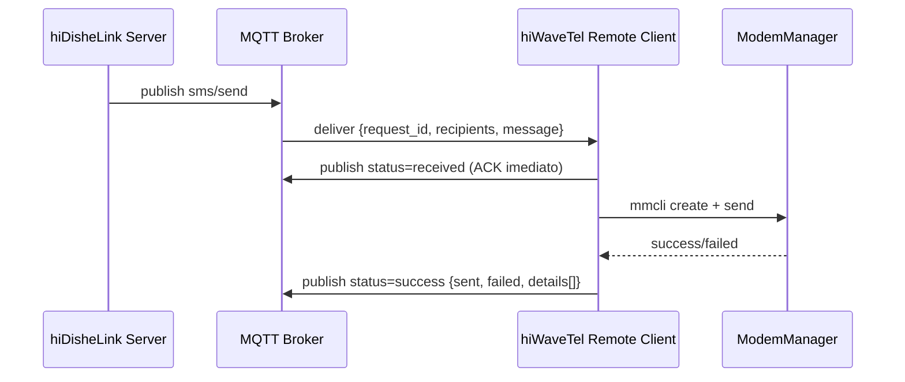
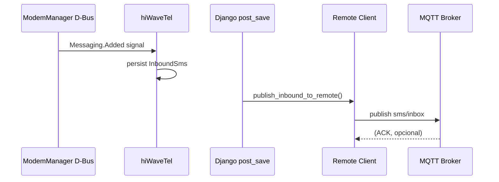

# hiDisheLink Bridge Mode — Guia de Deployment

Este documento descreve como configurar e operar hiWaveTel em **modo bridge**, ligando-se ao broker MQTT remoto hiDisheLink para atuar como **Device/Gateway Client** conforme seção 10 da arquitetura hiDisheLink.

## Índice

1. [Visão Geral](#visão-geral)
2. [Arquitetura Dual-Client](#arquitetura-dual-client)
3. [Configuração](#configuração)
4. [Deployment](#deployment)
5. [Fluxos de Mensagens](#fluxos-de-mensagens)
6. [Troubleshooting](#troubleshooting)
7. [Monitorização](#monitorização)

---

## Visão Geral

### O que é o Modo Bridge?

hiWaveTel em modo bridge funciona como gateway intermediário:

- **Conecta-se ao broker MQTT remoto hiDisheLink** (ex: `mqtt.hidishe.com`)
- **Subscreve `sms/send`** para receber pedidos de envio SMS
- **Processa via modem local** usando ModemManager/mmcli
- **Publica `sms/status` e `sms/inbox`** de volta ao broker remoto
- **Responde health pings** e envia heartbeats periódicos

```
┌─────────────────┐         ┌──────────────────┐         ┌─────────────┐
│  hiDisheLink    │◄────────┤  hiWaveTel       │◄────────┤  Modem      │
│  MQTT Broker    │  MQTT   │  Bridge Gateway  │  mmcli  │  Hardware   │
│  (Remote)       │────────►│  + Local Broker  │────────►│  (SMS)      │
└─────────────────┘         └──────────────────┘         └─────────────┘
      ▲                            ▲
      │                            │
      │                            │
 hiDisheLink                  Android App
 Platform                    (local broker)
```

### Conformidade com Spec hiDisheLink

Implementa **checklist completo da seção 10.10**:

1. ✅ Sanitiza `device_id` nos tópicos (remove `+` e `#`)
2. ✅ QoS 1 para todas mensagens SMS e health
3. ✅ Publica `status: received` ACK imediato antes de enviar SMS
4. ✅ Publica status final com `details[]` por destinatário
5. ✅ Responde `health/pong` a probes com `source: django`
6. ✅ Envia heartbeat `health/ping` sem `source: django`
7. ✅ Publica inbox com `message_id` único e aguarda ACK
8. ✅ Reconecta MQTT automaticamente (Paho built-in)
9. ✅ Agrega chunks SMS com mesmo `request_id`
10. ✅ Obtém config via API `/api/sms/device/mqtt-config/`

---

## Arquitetura Dual-Client

hiWaveTel opera **dois clientes MQTT em paralelo**:

### RemoteHiDishelinkClient

Conecta ao **broker remoto hiDisheLink**:

- **Subscreve:**
  - `TOPIC_SMS_SEND` — recebe pedidos SMS
  - `TOPIC_HEALTH_PING` — recebe probes do servidor
  - `TOPIC_SMS_INBOX_ACK` — recebe ACKs de inbox

- **Publica:**
  - `TOPIC_SMS_STATUS` — reporta status de envio
  - `TOPIC_SMS_INBOX` — reporta SMS recebidos
  - `TOPIC_HEALTH_PONG` — responde a probes
  - `TOPIC_HEALTH_PING` — heartbeat telemetria (sem `source:django`)

- **QoS:** 1 para todas as mensagens (reliability)
- **Session:** Persistent (`clean_session=false`)
- **Client ID:** `hiwavetel_remote_{sanitized_id}_{timestamp}`

### LocalGatewayClient

Conecta ao **broker local** (opcional):

- Mantém compatibilidade com devices Android
- Subscreve `{prefix}/+/sms/status`, `+/sms/inbox`, `+/health/*`
- Comportamento legacy do `GatewayMqttClient` original
- Pode ser desligado com `MQTT_LOCAL_BROKER_ENABLED=false`

---

## Configuração

### 1. Variáveis de Ambiente (`.env`)

```bash
# =============================================================================
# Remote hiDisheLink Bridge
# =============================================================================

# Activar modo bridge
MQTT_REMOTE_BRIDGE_ENABLED=true

# Manter broker local para Android (opcional)
MQTT_LOCAL_BROKER_ENABLED=true

# Device ID do gateway (E.164 format)
# Se vazio, usa primeiro HiDishelinkDevice activo da BD
MQTT_REMOTE_DEVICE_ID=+351912329317

# Intervalo de heartbeat telemetria (segundos)
MQTT_REMOTE_HEALTH_HEARTBEAT_SEC=60
```

### 2. Django Admin — HiDishelinkDevice

Criar registo em **`/admin/external_device/hidishelinkdevice/`**:

| Campo | Valor |
|-------|-------|
| `device_id` | `+351912329317` (E.164) |
| `api_url` | `https://api.hidishe.com` |
| `api_key` | Chave obtida do servidor hiDisheLink |
| `status` | `active` |

O `run_mqtt_gateway` comando:
1. Chama `GET {api_url}/api/sms/device/mqtt-config/` com `X-API-Key`
2. Guarda resposta em `mqtt_config` (JSON snapshot)
3. Usa `TOPIC_*` templates e credenciais broker

### 3. Broker Remoto Acessível

Garantir que hiWaveTel consegue aceder ao broker remoto:

```bash
# Teste de conectividade
docker exec -it hiwavetel bash
nc -zv mqtt.hidishe.com 1883

# Ou mosquitto_pub test
mosquitto_pub -h mqtt.hidishe.com -p 1883 -u user -P pass -t test -m '{"test":true}'
```

---

## Deployment

### Docker Compose

```bash
# 1. Configurar .env
cp .env.example .env
nano .env  # Editar variáveis MQTT_REMOTE_*

# 2. Criar HiDishelinkDevice no admin Django
docker compose up -d
docker compose exec hiwavetel python manage.py createsuperuser
# Aceder http://localhost:8000/admin/

# 3. Iniciar gateway com dual-client
docker compose restart hiwavetel

# 4. Verificar logs
docker compose logs -f hiwavetel | grep -i "remote\|local"
```

### Logs Esperados (Startup)

```
RemoteHiDishelinkClient initialized device=+351912329317 broker=mqtt.hidishe.com:1883
Remote bridge: fetched MQTT config from hiDisheLink API (device +351912329317)
RemoteHiDishelinkClient connecting to mqtt.hidishe.com:1883
RemoteHiDishelinkClient connected successfully device=+351912329317
RemoteHiDishelinkClient subscribed to: hidishelink/devices/351912329317/sms/send, .../health/ping, .../sms/inbox/ack
Remote hiDisheLink bridge started (device +351912329317)
Local gateway: fetched MQTT config from hiDisheLink API (device +351912329317)
Connected to MQTT broker successfully
Local MQTT gateway started
```

### Management Command

```bash
# Executar manualmente
python manage.py run_mqtt_gateway

# Flags implícitas (via settings):
# - MQTT_REMOTE_BRIDGE_ENABLED=true → inicia RemoteHiDishelinkClient
# - MQTT_LOCAL_BROKER_ENABLED=true → inicia LocalGatewayClient
```

---

## Fluxos de Mensagens

### SMS Outbound (hiDisheLink → hiWaveTel → Modem)



**Payload sms/send:**
```json
{
  "request_id": "req_abc123",
  "recipients": ["+351912345678"],
  "message": "Test SMS",
  "priority": "normal",
  "timestamp": "2026-05-20T12:00:00Z"
}
```

**Payload status (ACK):**
```json
{
  "request_id": "req_abc123",
  "status": "received",
  "timestamp": "2026-05-20T12:00:01Z"
}
```

**Payload status (final):**
```json
{
  "request_id": "req_abc123",
  "device_id": "+351912329317",
  "status": "success",
  "sent": 1,
  "failed": 0,
  "timestamp": "2026-05-20T12:00:05Z",
  "details": [
    {
      "recipient": "+351912345678",
      "status": "sent",
      "message_id": "/org/freedesktop/ModemManager1/SMS/1"
    }
  ]
}
```

### SMS Inbound (Modem → hiWaveTel → hiDisheLink)



**Payload inbox:**
```json
{
  "message_id": "hidw_inbound_123_0",
  "sender": "+351912345678",
  "body": "Reply from customer",
  "timestamp": "2026-05-20T12:05:00Z"
}
```

### Health Check

**Server probe (tipo B):**
```json
// Tópico: .../health/ping
{
  "ping_id": "ping_abc123",
  "timestamp": "2026-05-20T12:00:00Z",
  "source": "django"
}
```

**Gateway response:**
```json
// Tópico: .../health/pong
{
  "ping_id": "ping_abc123",
  "timestamp": "2026-05-20T12:00:01Z",
  "source": "hiwavetel_gateway",
  "ping_timestamp": "2026-05-20T12:00:00Z"
}
```

**Gateway heartbeat (tipo A):**
```json
// Tópico: .../health/ping
{
  "timestamp": "2026-05-20T12:01:00Z",
  "battery_level": 100,
  "network_type": "Ethernet"
}
```

---

## Troubleshooting

### Remote Client Não Liga

**Sintoma:** `Remote client disabled` nos logs.

**Causas comuns:**
1. `MQTT_REMOTE_DEVICE_ID` vazio e sem `HiDishelinkDevice` activo
2. Sem `mqtt_config` snapshot ou fetch falhou
3. Broker remoto inacessível

**Solução:**
```bash
# 1. Verificar HiDishelinkDevice
docker compose exec hiwavetel python manage.py shell
>>> from apps.external_device.models import HiDishelinkDevice
>>> HiDishelinkDevice.objects.filter(status='active')

# 2. Testar fetch mqtt-config
>>> from apps.external_device.mqtt_config_remote import fetch_mqtt_config_for_hidishelink_row
>>> hid = HiDishelinkDevice.objects.first()
>>> cfg = fetch_mqtt_config_for_hidishelink_row(hid)

# 3. Verificar conectividade broker
docker compose exec hiwavetel nc -zv mqtt.hidishe.com 1883
```

### Chunks Não Agregam

**Sintoma:** Status final publicado antes de todos os chunks chegarem.

**Debug:**
```python
# Verificar buffer de chunks
>>> from apps.external_device import mqtt_client
>>> client = mqtt_client._global_remote_client
>>> client._chunk_buffer
```

**TTL chunks:** 5 minutos (300s). Se chunks demoram mais, expiram.

### Inbound SMS Não Publica

**Sintoma:** SMS recebidos no modem mas não aparecem no broker remoto.

**Checklist:**
1. `MQTT_REMOTE_BRIDGE_ENABLED=true`?
2. `_global_remote_client` está definido?
3. Signal handler `mirror_inbound_to_device_inbox` activo?
4. InboundSms tem `sender` ou `body` (not empty)?

**Debug:**
```bash
docker compose logs hiwavetel | grep "publish_inbound_to_remote"
```

### QoS 0 em vez de QoS 1

**Sintoma:** Mensagens perdidas durante desconexões.

**Verificar:**
- `RemoteHiDishelinkClient` sempre usa `qos=1` hardcoded
- `mqtt_config` resposta tem `MQTT_QOS: 1`?
- Paho client logs: `qos=1` nas publish calls

---

## Monitorização

### Métricas Recomendadas

| Métrica | Como obter | Alerta se |
|---------|------------|-----------|
| Remote client connected | Logs `RemoteHiDishelinkClient connected` | Não reconecta em 60s |
| SMS requests received | Count `RemoteHiDishelinkClient SMS send received` | Zero durante 5min (esperado tráfego) |
| SMS status publishes | Count `published SMS status request_id` | Falhas > 5% |
| Health pong RTT | Log `published health pong ping_id` timestamp delta | > 2s |
| Chunk buffer size | `len(_chunk_buffer)` | > 10 entries (possível leak) |
| Inbound publish success | `publish_inbound_to_remote` return True ratio | Falhas > 5% |

### Logs Úteis

```bash
# Remote client lifecycle
docker compose logs hiwavetel | grep "RemoteHiDishelinkClient"

# SMS flow
docker compose logs hiwavetel | grep "Remote SMS"

# Health checks
docker compose logs hiwavetel | grep "health"

# Chunking
docker compose logs hiwavetel | grep "chunk"
```

### Health Check Script

```python
#!/usr/bin/env python3
"""Check hiWaveTel remote bridge health."""

import requests
import sys

# Check modem
r = requests.get('http://localhost:8000/api/health/')
if r.status_code != 200:
    print(f"Modem health FAIL: {r.status_code}")
    sys.exit(1)

# Check remote client (via logs or custom endpoint)
# TODO: Implementar endpoint /api/mqtt/remote/health/

print("hiWaveTel bridge health: OK")
```

---

## Referências

- [Arquitetura hiDisheLink MQTT](../README.md) — documento completo da spec
- [Comunicação hiWaveTel](./comunicacao.md) — API REST + MQTT local
- [Seção 10: Integração hiWaveTel Gateway](../README.md#10-integração-hiwavetel-gateway) — contrato Device/Gateway Client
- [Código RemoteHiDishelinkClient](../apps/external_device/mqtt_client.py)
- [Testes](../tests/test_remote_hidishelink_client.py)
